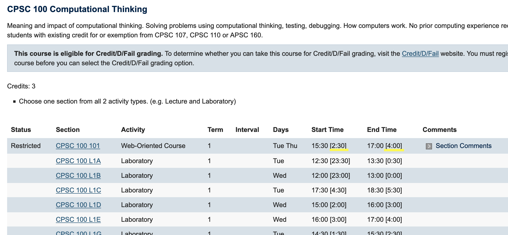

# WebExtensions
some web extensions for productivity

## UBC-timezone
Firefox and Chrome extension for people studying outside of Vancouver BC to schedule their classes according to their own timezone.

<b>Details</b>

Screenshot below shows adjusted time for Moscow Standard Time, which is 11 hours ahead of Vancouver.
  
[Link to sample UBC course schedule] 

[Link to sample UBC course schedule]: https://courses.students.ubc.ca/cs/courseschedule?pname=subjarea&tname=subj-course&dept=CPSC&course=110

